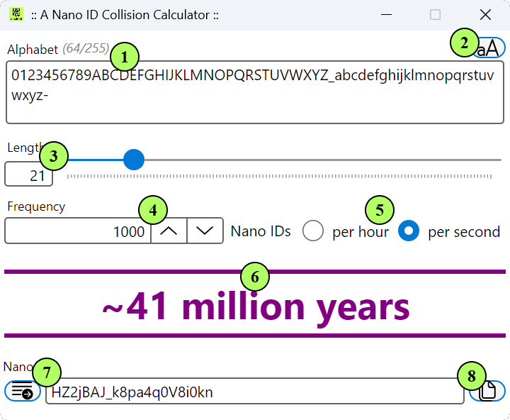

Utilities: Complexity Calculator
===

While ananoid's defaults are a good choice for many use cases, it can nevertheless be desirable
to change the size or alaphabet used for generating Nano IDs. To that end, the libray ships with
a number [pre-defined alphabets][1], and even lets you [define your own][2]. However, it's important
to understand the relationship between alphabet, nano id length, and the possibility (however small)
of having _collisions_. To help with this, the ananoid repository contains a small tool, called
anaoidcc (inspired by the excellent [nano-id-cc][10]!), which can help you figure out the likelihood
of collisions for a given alphabet and nano id length.

> ##Attention!!!
>
> __So far, ananoidcc has only been tested on Ubuntu 24.04 and Windows 11.__
>

### Features

<div class="lang-bar">
<details open class="lang-block">
<summary>ananoidcc</summary>


</details>
</div>

1. **Alphabet** ... the set of "letters" from which a Nano ID is generated. Can be one of the pre-defined sets, or a custom one.
2. **Alphabet Picker** ... a dropdown to select one of the pre-defined alphabets, which will automatically update the 'Alphabet' field.
3. **Desired Length** ... the length of the Nano ID to be generated. The longer the length, the less likely it is to have collisions.
4. **Frequency** ... the number of Nano IDs generated per interval. This is relevant for calculating the likelihood of collisions, as the more nano ids are generated, the higher the chances of a collision.
5. **Frequency Interval** ... the time interval for which the frequency is calculated, either per hour or per second.
6. **Complexity** ... the likelihood (at a probability of 1%) of a collision, expressed as a duration of time. The longer the duration, the less likely it is to have a collision.
7. **Generator** ... the command to generate a Nano ID with the specified alphabet and length.
8. **Clipboard** ... a button to copy the generated Nano ID to the clipboard, for easy pasting into other applications.

### Installation

The ananoidcc tool can be built from source following the instructions in the [README][9] file
for the repository. However, pre-compiled binaries are also available for download, for both
[Windows][7] and [Linux][8]. Once downloaded:

1. Unzip the downloaded file to a location of your choice.
2. Double-click the `ananoidcc` executable to launch the tool.

### Calculation

Similar to [UUID][5], there is always a possibility of a collision when generating Nano IDs. It remains very low,
but it is non-zero. More importantly, the likelihood of a collision depends on several factors:

+ The size of the alphabet (ie: the number of possible characters that can be used to generate a Nano ID);
+ The number of letters in the of the generated Nano ID;
+ The frequency of generation (ie: how many Nano IDs are generated per unit of time).

The ananoidcc tool calculates the likelihood of a collision, while letting you adjust the various parameters.
Using the [birthday problem][3] and [birthday attack][4] mathematics, the tool effectively estimates the number of Nano
IDs that can be generated before a collision occurs, with a probability (`p`) of 1%. The estimation is based on the
formula: `n(p;H) ≈ √(2H·ln(1/(1-p)))`, where `H = 2^entropy` and `entropy` is the possible number of bits in a single
generated identifier. It then calculates the time it would take to generate that many Nano IDs at the specified
frequency (ie: at a stable rate of generation).

The code can be (roughly) explained as follows:

<div class="lang-bar">
<details open class="lang-block">
<summary>F#</summary>

```fsharp
// Active pattern to compute the whitespace-trimmed length of a string,
// returning 0 if the input is null or consists entirely of whitespace
let inline (|Length|) value =
  if String.IsNullOrWhiteSpace(value) then 0 else value.Trim().Length

let timeToCollision (Length alphabetLength) nanoIdLength frequencyInSeconds =
  if 0 < alphabetLength && alphabetLength < 256 && 0 < nanoIdLength then
    // Target probability
    let P = 0.01

    // Number of bits is a single Nano ID, based on:
    // 1. the number of letters in the alphabet
    // 2. the length of the generated Nano ID
    let entropy = float nanoIdLength * (log (float alphabetLength) / log 2.0)

    // Estimated number of generated until collision at target probability:
    let numberOfIds = sqrt (2.0 * Math.Pow(2.0, entropy) * (log (1.0 / (1.0 - P))))

    // Theoretical time needed to generate until collision
    floor (numberOfIds / frequencyInSeconds)
  else
    // cannot compute time-to-collision because inputs are invalid
    nan
```
</details>

<details open class="lang-block">
<summary>VB</summary>

```vb
' Target probability
Private Const P As Double = 0.01

Public Function TimeToCollision(
  alphabet As String,
  nanoIdLength As Integer,
  frequencyInSeconds As Double
) As Double

  Dim alphabetLength As Integer = If(String.IsNullOrWhiteSpace(alphabet), 0, alphabet.Trim().Length)

  ' Cannot compute time-to-collision because inputs are invalid
  If alphabetLength <= 0 OrElse alphabetLength >= 256 OrElse nanoIdLength <= 0 Then
      Return Double.NaN
  End If

  ' Number of bits in a single Nano ID, based on:
  ' 1. the number of letters in the alphabet
  ' 2. the length of the generated Nano ID
  Dim entropy As Double = nanoIdLength * (Math.Log(alphabetLength) / Math.Log(2.0))

  ' Estimated number of IDs generated until collision at target probability
  Dim numberOfIds As Double = Math.Sqrt(2.0 * Math.Pow(2.0, entropy) * Math.Log(1.0 / (1.0 - P)))

  ' Theoretical time needed to generate until collision
  Return Math.Floor(numberOfIds / frequencyInSeconds)
End Function
```
</details>

<details open class="lang-block">
<summary>C#</summary>

```csharp
// Target probability
private const double P = 0.01;

public static double TimeToCollision(string alphabet, int nanoIdLength, double frequencyInSeconds)
{
  var alphabetLength = string.IsNullOrWhiteSpace(alphabet) ? 0 : alphabet.Trim().Length;
  // Cannot compute time-to-collision because inputs are invalid
  if (alphabetLength is <= 0 or >= 256 || nanoIdLength <= 0) return double.NaN;

  // Number of bits is a single Nano ID, based on:
  // 1. the number of letters in the alphabet
  // 2. the length of the generated Nano ID
  var entropy = nanoIdLength * (Log(alphabetLength) / Log(2.0));

  // Estimated number of generated until collision at target probability
  var numberOfIds = Sqrt(2.0 * Pow(2.0, entropy) * Log(1.0 / (1.0 - P)));

  // Theoretical time needed to generate until collision
  return Floor(numberOfIds / frequencyInSeconds);
}
```
</details>
</div>

### Further Reading

+ [Math: The birthday problem][3]
+ [Math: Collinsion in UUID][5]
+ [How-To: Customize NanoId Creation][6]

### Copyright

The library is available under the Mozilla Public License, Version 2.0.
For more information see the project's [License][0] file.


[0]: https://github.com/pblasucci/ananoid/blob/main/LICENSE.txt
[1]: ../reference/pblasucci-ananoid-knownalphabets.html
[2]: ../guides/definecustom.html
[3]: https://en.wikipedia.org/wiki/Birthday_problem
[4]: https://en.wikipedia.org/wiki/Birthday_attack#Mathematics
[5]: https://en.wikipedia.org/wiki/Universally_unique_identifier#Collisions
[6]: ../guides/nanoidoptions.html
[7]: https://github.com/pblasucci/ananoid/releases/download/v2.0.0/ananoidcc.2.0.0-win-x64.zip
[8]: https://github.com/pblasucci/ananoid/releases/download/v2.0.0/ananoidcc.2.0.0-linux-x64.zip
[9]: https://github.com/pblasucci/ananoid/#readme
[10]: https://zelark.github.io/nano-id-cc/
