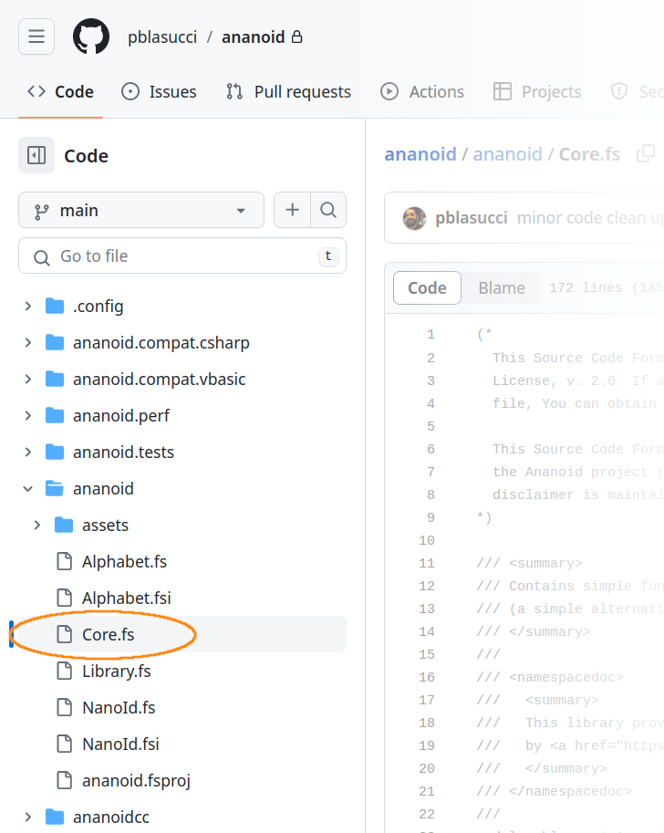

How-To: Install the Core Module from Source
===

Ananoid can serve most uses cases via the `cref:T:pblasucci.Ananoid.NanoId`
type and its associates (`cref:T:pblasucci.Ananoid.NanoIdOptions`,
`cref:T:pblasucci.Ananoid.NanoIdParser`, et cetera). However, sometimes this is
not desired (or at least, not _optimal_). For times when the a struct or class
is just too much, Ananoid also provides its core functionality --
cryptographically-secure randomly-generated identifiers -- as functions which
take simple inputs and just produce strings.

Further, there are some circumstances wherein it might be advantageous to only
take the lowest-level parts of the library as a _source-code dependency_ (the
so-called "vendorizing" of dependencies). In order to accomodate this, the
library has been carefully structured so that you may simply copy the file
[`Core.fs`][1] into your project and treat these functions as just another
module in your library/application/et cetera.

> ---
> ##Attention!!!
>
> __Unfortunately, this is only applicable for F# projects... sorry ¯\_(ツ)_/¯.__
>
> ---

OUT

### Related Reading

+ [How-To: Work with Tagged NanoId strings][2]
+ [Performance: Select Highlights][3]

### Copyright
The library is available under the Mozilla Public License, Version 2.0.
For more information see the project's [License][0] file.

[0]: https://github.com/pblasucci/ananoid/blob/main/LICENSE.txt
[1]: https://github.com/pblasucci/ananoid/blob/main/ananoid/Core.fs
[2]: ../guides/taggednanoid.html
[3]: ../explanations/highlights.html
